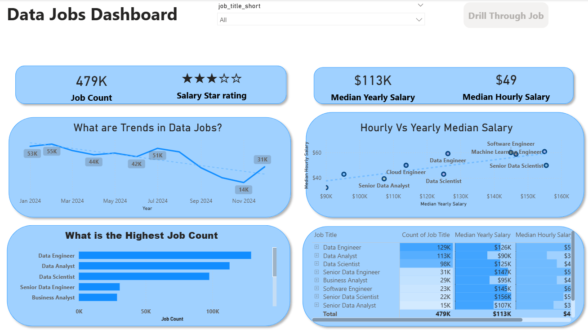
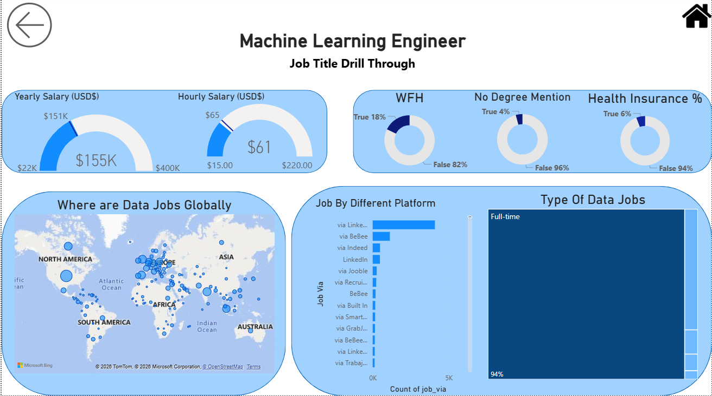

# 📊 Data Jobs Dashboard | Power BI Project

## Dashboard Preview

### 🖥 Main Dashboard


### 🔍 Drill Through Dashboard


---

# 📌 Introduction

The **Data Jobs Dashboard** is an interactive Power BI project focused on analyzing the global data job market.  
This dashboard was created to explore trends in data-related careers such as Data Analyst, Data Engineer, Data Scientist, Machine Learning Engineer, and other analytical roles.

The project provides insights into:
- Job demand across different roles
- Salary trends and comparisons
- Global distribution of jobs
- Remote work opportunities
- Hiring platforms
- Employment types and benefits

The goal of this dashboard is to transform raw job posting data into meaningful business insights using data visualization and analytics techniques.

---

# 🛠 Skills & Technologies Used

## 📊 Power BI Skills
- Data Cleaning using Power Query
- Data Modeling
- DAX Measures & Calculations
- KPI Development
- Interactive Dashboard Design
- Drill Through Navigation
- Data Visualization
- Dashboard Storytelling

---

## 📈 Analytical Skills Demonstrated
- Trend Analysis
- Salary Analysis
- Job Market Analysis
- Comparative Analysis
- Business Intelligence Reporting
- Data Interpretation

---

## ⚙ Tools & Technologies
- Power BI Desktop
- Power Query
- DAX
- Excel / CSV Dataset

---

# 📖 Dashboard Overview

# 🖥 Page 1 — Main Dashboard

The first page provides a high-level overview of the data jobs market and highlights key hiring and salary trends.

## Key Metrics
- Total Job Count
- Median Yearly Salary
- Median Hourly Salary
- Salary Rating

## Visuals Included
- Monthly Job Trend Analysis
- Hourly vs Yearly Salary Comparison
- Highest Job Count by Role
- Job Summary Table
- Interactive Slicers

## Key Insights
- Data Engineer roles have the highest number of openings.
- Senior-level positions generally offer higher salaries.
- Salary trends fluctuate throughout the year.
- Data Scientist and Machine Learning Engineer roles remain among the highest-paying positions.

---

# 🌍 Page 2 — Job Title Drill Through Dashboard

The second page provides a detailed drill-through analysis for specific job roles, with a focus on Machine Learning Engineer positions.

## Key Metrics
- Average Yearly Salary
- Average Hourly Salary
- Work From Home Availability
- Degree Requirement Percentage
- Health Insurance Availability

## Visuals Included
- Salary Gauge Charts
- Donut Charts
- Global Job Distribution Map
- Platform-wise Job Posting Analysis
- Job Type Treemap

## Key Insights
- Most data-related roles are Full-Time positions.
- Remote job opportunities are increasing across the industry.
- North America and Europe show the highest concentration of data jobs.
- LinkedIn and other major platforms dominate job postings.
- Many positions focus more on skills and experience rather than strict degree requirements.

---

# 📂 Project Structure

```text
├── Data Jobs Dashboard.pbix
├── dataset/
│   └── data_jobs.csv
├── images/
│   ├── dashboard-page1.png
│   └── dashboard-page2.png
└── README.md
```

---

# 🚀 Features
- Interactive Power BI Dashboard
- Drill Through Functionality
- Dynamic Filtering & Slicers
- Salary Trend Analysis
- Global Job Market Insights
- Employment Type Analysis
- Platform-wise Hiring Analysis

---

# 📊 Business Questions Answered

This dashboard helps answer important questions such as:
- Which data roles are most in demand?
- What are the highest-paying data jobs?
- How are salaries distributed across roles?
- Which regions have the most job opportunities?
- How common are remote jobs in data careers?
- Which platforms are used most for hiring?

---

# 🧠 What I Learned

Through this project, I strengthened my understanding of:
- Building interactive dashboards in Power BI
- Designing dashboards for storytelling
- Converting raw datasets into actionable insights
- Using visual analytics for business decision-making

# ⭐ Support

If you found this project useful, feel free to give it a ⭐ on GitHub.